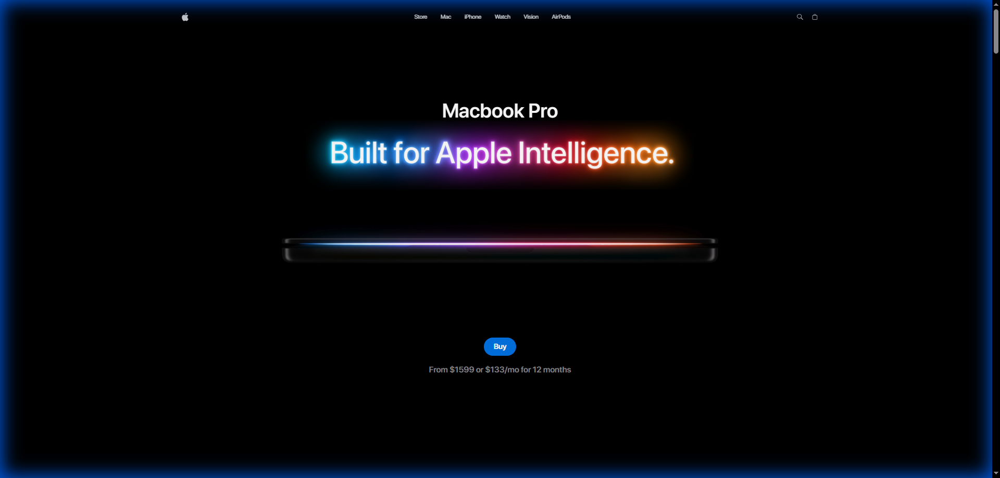
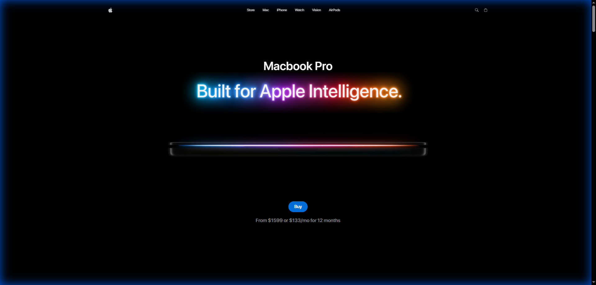
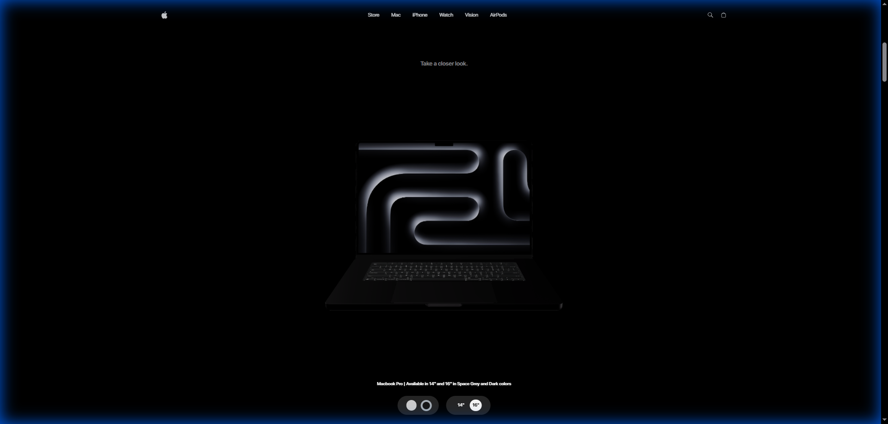
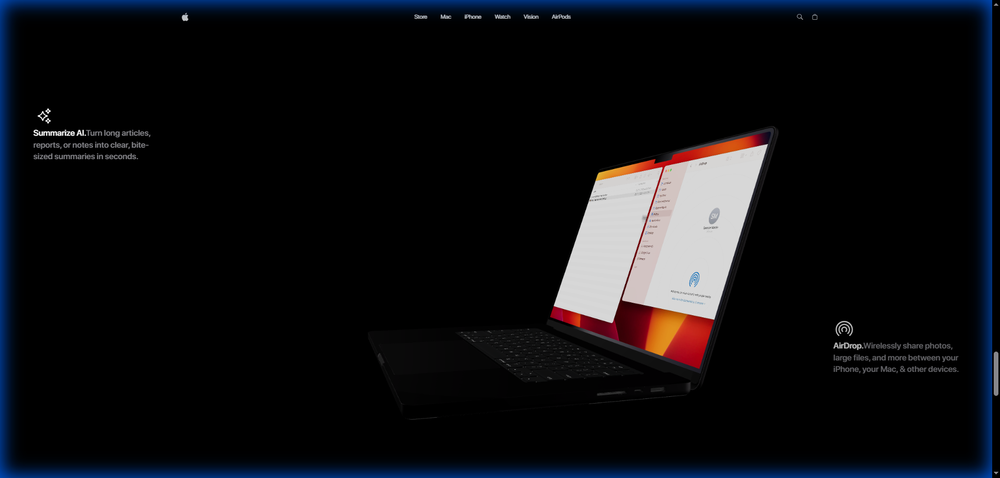
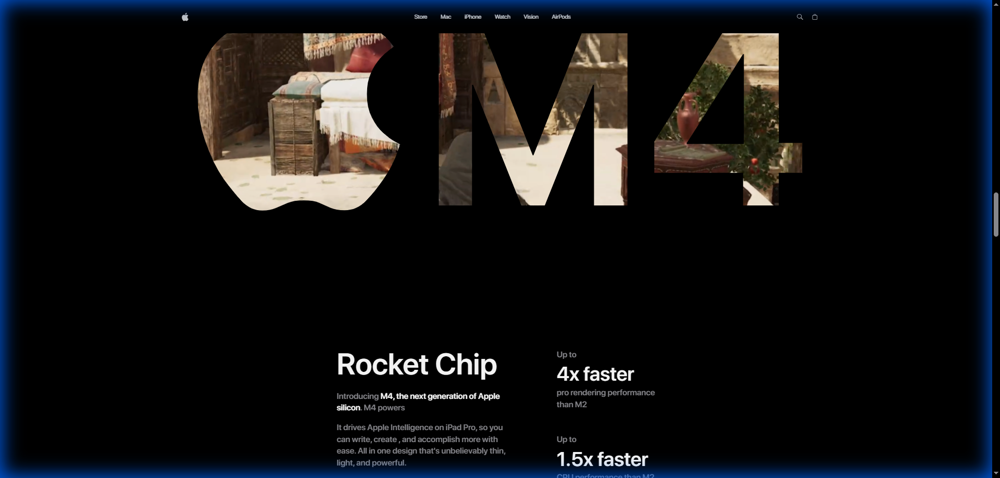

# Apple Clone - GSAP & Three.js Macbook Showcase

<div align="center">
  
</div>

<br />

[](https://apple-clone-lime-phi.vercel.app)
[](https://react.dev/)
[](https://threejs.org/)
[](https://greensock.com/gsap/)

##  Project Overview

This project is a high-fidelity web application built to showcase the MacBook Pro using advanced 3D rendering and immersive animations. It is designed for developers and designers who want to explore the intersection of **web performance** and **visual excellence**.

### Why this project?
- **Interactive 3D**: Engage with a detailed MacBook model in real-time.
- **Cinematic Animations**: Smooth transitions powered by GSAP.
- **Premium Design**: Apple-inspired aesthetics with high-end typography and layouts.

---

## 🚀 Tech Stack

| Technology         | Version   | Description                                      |
| ------------------ | --------- | ------------------------------------------------ |
| **React**          | v19.2.0   | Frontend framework for UI components.            |
| **Three.js**       | v0.182.0  | Core 3D engine for rendering the Macbook model.  |
| **GSAP**           | v3.14.2   | High-performance animations and scroll triggers. |
| **Vite**           | v7.2.4    | Lightning-fast build tool and dev server.        |
| **Tailwind CSS**   | v4.1.18   | Utility-first styling for premium UI.            |
| **Zustand**        | v5.0.9    | Lightweight state management.                   |
| **Vercel**         | Platform  | Deployment and hosting.                          |

---

## 📸 Screenshots

<table align="center">
  <tr>
    <td align="center">
      <br />
      <b>Hero Landing</b><br />
      Dynamic tagline with GSAP animations
    </td>
    <td align="center">
      <br />
      <b>3D Model Viewer</b><br />
      Interactive Three.js Macbook Pro model
    </td>
  </tr>
  <tr>
    <td align="center">
      <br />
      <b>Advanced Features</b><br />
      Immersive feature highlights
    </td>
    <td align="center">
      <br />
      <b>Performance Specs</b><br />
      High-fidelity performance metrics
    </td>
  </tr>
</table>


### ✨ Visual Highlights:
- **Hero Animation**: Smooth CSS/GSAP transitions on load.
- **3D Interaction**: Real-time lighting and texture rendering.
- **Responsive Design**: Optimized for all modern screen sizes.
- **Micro-interactions**: Hover effects and scroll-triggered animations.

---

## 🛠 Getting Started for Developers

### Prerequisites
- **Node.js**: v20.x or higher recommended.
- **npm**: v10.x or higher.

### Installation

1. **Clone the repository:**
   ```bash
   git clone https://github.com/your-username/gsap-macbook.git
   cd gsap-macbook
   ```

2. **Install dependencies:**
   ```bash
   npm install
   ```

3. **Run locally:**
   ```bash
   npm run dev
   ```

4. **Build for production:**
   ```bash
   npm run build
   ```

---

## 🌐 Live Demo

Visit the interactive experience here: [https://apple-clone-lime-phi.vercel.app](https://apple-clone-lime-phi.vercel.app)

---

Developed with ❤️ by [Tsvetan Markov]
